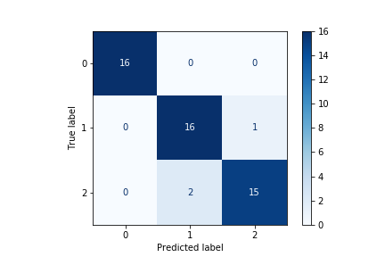
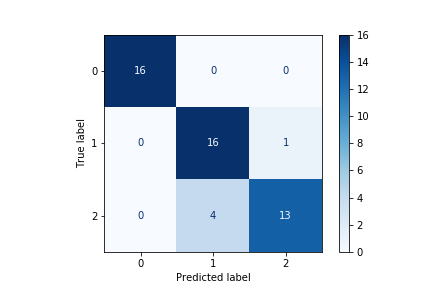

# Iris Classification
Introduction to classification techniques with sklearn iris dataset.

Notebooks create and analyze the Iris Classification data with sklearn.

Visualize and save results. 

**NOTE:** Notebooks are very short by design. This separation will help highlight methods for saving and loading data.

## Goals

These notebooks showcase classification with sklearn, including visualizing results, comparing models, and selecting the best performing model using a given metric.

## Notebooks Overview

The notebooks for this example are numbered and must be run in order. 

1. 1_Generate_Data
    * Imports data from sklearn
    * Creates a new directory
    * Saves data to csv files in 'data' dir
1. 2_Train_Test_Split
    * Imports data using pandas from csv files
    * Uses sklearn train-test split to create training and test datasets
    * Saves split data back into csvs in 'data' dir
1. 3_EDA
    * Imports training data only to conduct exploratory data analysis (EDA)
    * Visualizes data with seaborn pairplot
    * Has a method to explore column level data including number of unique values and value counts
1. 4_Train_Models
    * Trains two models on training data
        * Logistic Regression
        * Random Forest Classifier
    * Saves models using joblib to file
    * Calculates performance on training data using confusion matrices and classification report
1. 5_Predict_and_Evaluate
    * Loads trained models and test data
    * Runs predictions on test data
    * Evaluates performance by:
        * Visualizing confusion matrices
        * Calculating accuracy
        * Generating other metrics with a classification report

## Example Results

The two plots below show predicted vs. actual values for the train and test dataset for both models tested. Confusion matrices for both models are shown on the test set. 

### Logistic Regression Confusion Matrix

### Random Forest Confusion Matrix

