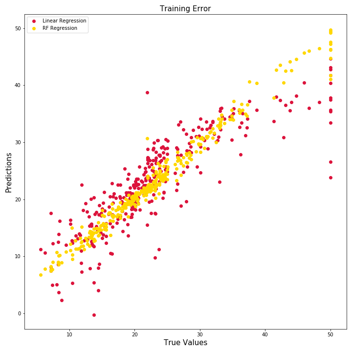
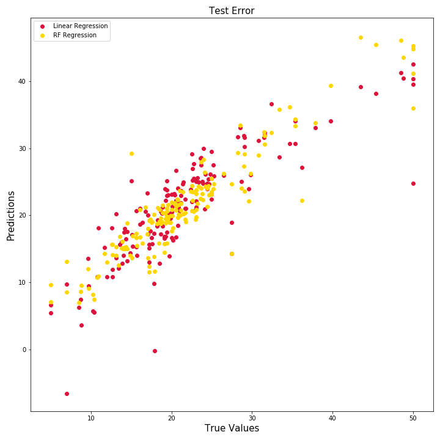

# Housing Regression Tutorial
Basic introduction to linear ML methods using the sklearn Boston housing dataset.

Notebooks use linear regression and random forest regressor models to create and analyze the Boston Housing data. 

## Repo Goals

These notebooks are short by design to allow rapid iteration, easy additions/testing, and highlight methods for transferring data between steps.

The focus here is on basic regression methodology. 

Check the following resources for broader points of interest:

- **[Python Overview](../../README.md)**
- **[Python Basics](../../Basics/)**
- **[Classification](../../ClassificationExamples)**

Check the [Environment](./../../Environment/README.md) section for help with packages and version control.

## Notebooks Overview

1. 1_Generate_Data
    * Imports data from sklearn
    * Saves data to csv files in 'data' dir
1. 2_Train_Test_Split
    * Imports data using pandas from csv files
    * Uses sklearn train-test split to create training and test datasets
    * Saves split data back into csvs in 'data' dir
1. 3_EDA
    * Imports training data only to conduct exploratory data analysis (EDA)
    * Visualizes data with seaborn pairplot
    * Has a method to explore column level data including number of unique values and value counts
1. 4_Train_Models
    * Fits two regression models:
        * Linear Regression
        * Random Forest Regressor
    * Saves models using joblib
    * Calculates performance on training data by visualizing errors and mean squared error calculation
1. 5_Predict_and_Evaluate
    * Loads trained models and test data
    * Runs predictions on test data
    * Evaluates performance by:
        * Visualizing prediction error
        * Mean squared error metric
        * Explained variance score metric

## Model Comparison

The two plots below show predicted vs. actual values for the train and test dataset for both models tested. The crimson dots represent the linear regression and the gold dots the random forest regressor. 

### Training Error Plot

### Test Error Plot

## Reset Results

To reset example with a clean workspace, remove all dirs and files except for this `README.md` and the `notebooks` directory.
- 